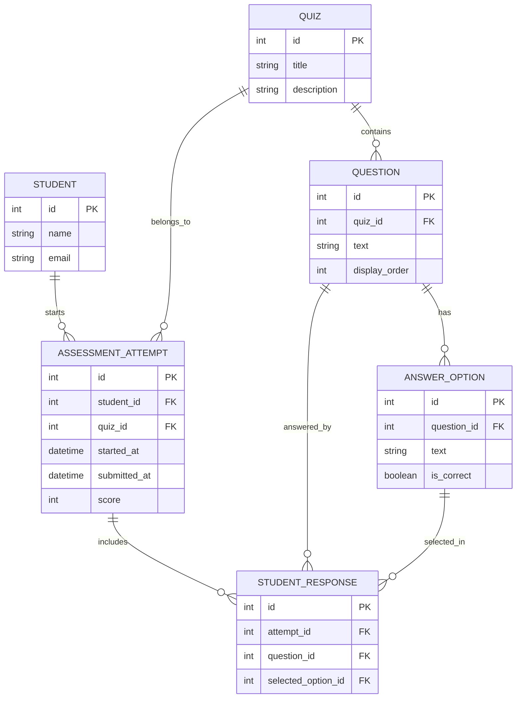

# Assessment Tool ERD

```mermaid
erDiagram
    QUIZ ||--o{ QUESTION : contains
    QUESTION ||--o{ ANSWER_OPTION : has
    STUDENT ||--o{ ASSESSMENT_ATTEMPT : starts
    QUIZ ||--o{ ASSESSMENT_ATTEMPT : belongs_to
    ASSESSMENT_ATTEMPT ||--o{ STUDENT_RESPONSE : includes
    QUESTION ||--o{ STUDENT_RESPONSE : answered_by
    ANSWER_OPTION ||--o{ STUDENT_RESPONSE : selected_in

    QUIZ {
        int id PK
        string title
        string description
    }

    QUESTION {
        int id PK
        int quiz_id FK
        string text
        int display_order
    }

    ANSWER_OPTION {
        int id PK
        int question_id FK
        string text
        boolean is_correct
    }

    STUDENT {
        int id PK
        string name
        string email
    }

    ASSESSMENT_ATTEMPT {
        int id PK
        int student_id FK
        int quiz_id FK
        datetime started_at
        datetime submitted_at
        int score
    }

    STUDENT_RESPONSE {
        int id PK
        int attempt_id FK
        int question_id FK
        int selected_option_id FK
    }
```
